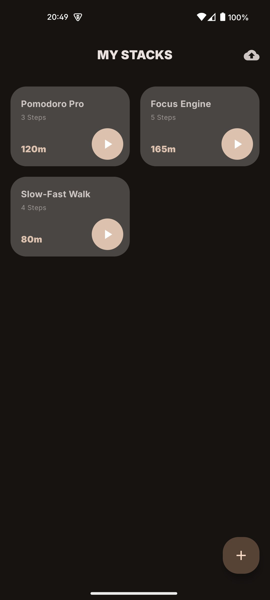
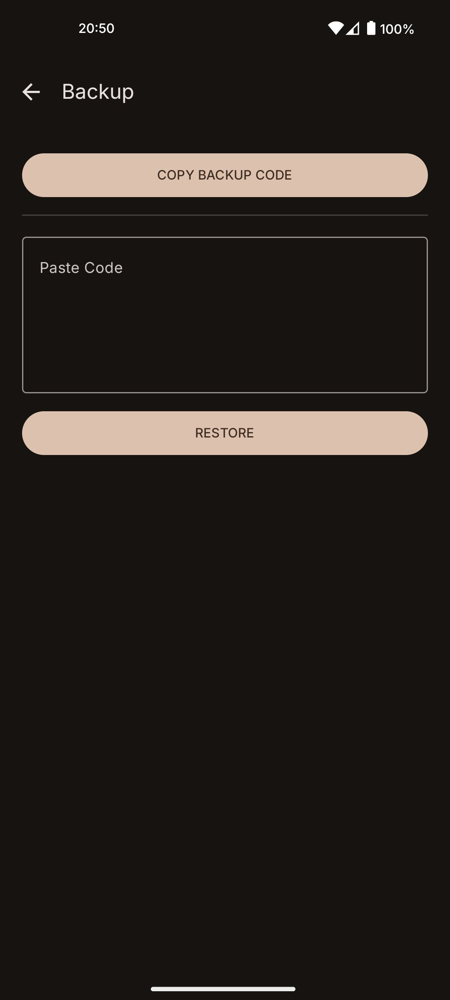

# ⏳ Stack Timer
**The Ultimate "Sequence of Time" Routine & Interval App**

Stack Timer is a professional-grade Android utility built for users who need to sequence their time. Unlike standard countdown apps, Stack Timer allows you to build a "Playlist of Time" by stacking individual segments into a single, seamless flow.

---

## 🚀 Key Features

### 🧱 The Block Builder (Editor)
Build your routine like Lego blocks. Create individual timer segments with custom labels and durations. Drag and drop to rearrange your flow instantly.

### 📈 The Vertical Timeline (Execution)
Visualize your progress through a vertical timeline. The "Hero" card shows the current timer with a thick progress ring and monospace typography, while upcoming intervals peek from the bottom.

### 📱 Optimized for One-Handed Use
Designed with modern, large-screen phones in mind. All critical controls—Start, Stop, Reset, and Add—are anchored at the bottom "Reach Zone."

### 💓 Tactile & Auditory Transitions
Precision haptic feedback and melodic audio chimes notify you of transitions, allowing for a truly eyes-free experience during workouts or tasks.

---

## 🎨 Design & Tech
- **Material You:** Fully supports Material 3 Dynamic Colors, adapting to your phone's wallpaper.
- **Local-First Privacy:** Uses a high-performance **Room Database** to store your stacks locally. No accounts or cloud required.
- **Buttery Smooth:** Built with **Jetpack Compose** and Spring Physics for 60fps animations.

---

## 🛠 Technical Stack
- **Language:** Kotlin
- **UI:** Jetpack Compose (Material 3)
- **Database:** Room Persistence Library
- **Animations:** Lottie & Compose Animation API
- **Architecture:** MVVM Pattern
- **Persistence:** GSON for JSON Serialization

---

## 💾 Backup & Restore
Never lose your routines. Export your entire library into a "Magic Code" string to backup manually or share your favorite stacks with friends.

---

## 📥 Installation
1. Go to the [Releases](https://github.com/YOUR_USERNAME/StackTimer/releases) section.
2. Download the `StackTimer_v1.0.apk`.
3. Open the file on your Android device and install.

   

  
  
  

